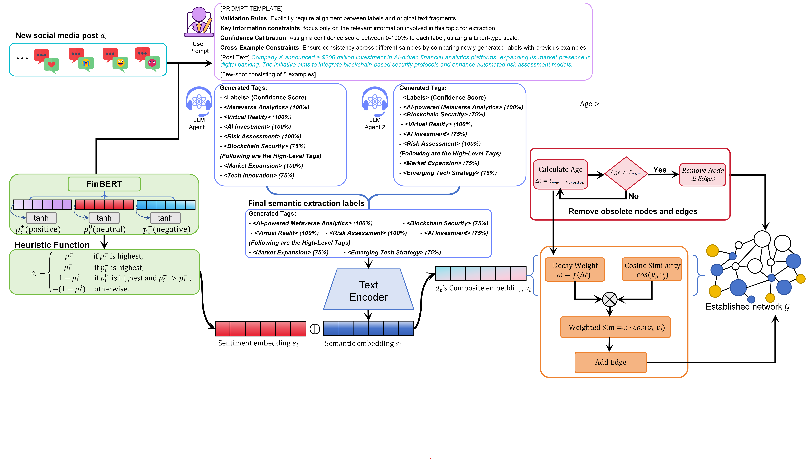

# SAIPN: Semantic-Affective Implicit Propagation Networks for Dynamic Social Sensing

本仓库为论文 **SAIPN: Semantic-Affective Implicit Propagation Networks for Dynamic Social Sensing** 的代码实现与实验脚本集合，主要用于从社交媒体数据中构建 **语义-情感驱动的隐式传播网络**（implicit propagation network），并在动态时间窗上进行网络演化分析与消融实验。

## Paper Overview

动态社交感知（Dynamic Social Sensing）中，信息扩散并不总是以“显式转发/回复链路”的形式出现；大量传播是 **隐式的**：内容语义相近、情感倾向相互影响、并在时间上呈现衰减或持续。

SAIPN 的核心思路是：

- 基于 **语义相似度**（文本向量）与 **情感强度/极性**（sentiment score）在时间窗内构建隐式边
- 引入 **时间衰减（time decay）** 与 **生命周期截断（hard cutoff）**，刻画传播影响随时间衰减
- 在动态网络上计算一组结构与传播相关指标（如 PageRank、模块度、同配性、CNLR、DCPRR 等）用于分析与对比
- 提供消融：
  - 无情感（No Sentiment）
  - 无标签/主题信息（No Tags）
  - 无时间衰减（No Time Decay）

> 注：论文的完整贡献点/公式细节请以论文原文为准；本仓库侧重实现与复现实验流程。

## Framework




## Installation

```bash
pip install pandas numpy torch networkx transformers sentence-transformers
```

Optional GPU acceleration:
```bash
pip install cugraph cudf  # RAPIDS for GPU graph algorithms
```

## Core Modules

### `saipn_core.embeddings`
- `generate_embeddings()` - Generate text embeddings
- `generate_embeddings_from_dataframe()` - Batch processing with IDs

### `saipn_core.sentiment`
- `analyze_sentiment()` - Sentiment analysis for text sequences
- `build_sentiment_map_from_probabilities()` - Convert probability scores to sentiment values

### `saipn_core.implicit_network`
- `load_vectors_to_device()` - Load pre-computed vectors to GPU
- `build_implicit_network()` - Main network construction algorithm
- `ImplicitNetworkConfig` - Configuration dataclass

### `saipn_core.metrics`
- `detect_communities_louvain()` - Community detection
- `calculate_cnlr_fast()` - Community new link rate
- `compute_basic_graph_metrics()` - Basic network statistics

### `saipn_core.dcprr`
- `calculate_all_dcprr_scores()` - Dynamic community propagation retention rate

### `saipn_core.cnlr`
- `calculate_cnlr_from_topk()` - CNLR from top-k node appearance data
- `parse_first_appearance()` - Parse top-k appearance timestamps

## Notes

- 仓库中部分脚本包含面向集群/HPC 的默认路径（例如 `BASE_DIR=/data_huawei/...`、`run.sh` 为 SLURM 脚本）。在本地运行时：
  - 优先通过命令行参数（如 `--data-file/--vector-file/--sentiment-file/--output-dir`）覆盖
  - 或者按需修改脚本内的路径常量


## License

Apache-2.0
