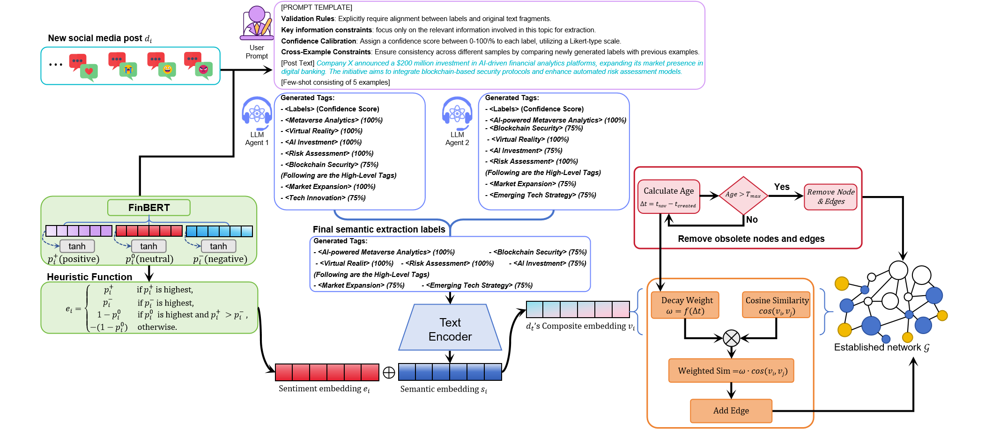

# SAIPN: Semantic-Affective Implicit Propagation Networks for Dynamic Social Sensing

本仓库为论文 **SAIPN: Semantic-Affective Implicit Propagation Networks for Dynamic Social Sensing** 的代码实现与实验脚本集合，主要用于从社交媒体数据中构建 **语义-情感驱动的隐式传播网络**（implicit propagation network），并在动态时间窗上进行网络演化分析与消融实验。

## Paper Overview

动态社交感知（Dynamic Social Sensing）中，信息扩散并不总是以“显式转发/回复链路”的形式出现；大量传播是 **隐式的**：内容语义相近、情感倾向相互影响、并在时间上呈现衰减或持续。

SAIPN 的核心思路是：

- 基于 **语义相似度**（文本向量）与 **情感强度/极性**（sentiment score）在时间窗内构建隐式边
- 引入 **时间衰减（time decay）** 与 **生命周期截断（hard cutoff）**，刻画传播影响随时间衰减
- 在动态网络上计算一组结构与传播相关指标（如 PageRank、模块度、同配性、CNLR、DCPRR 等）用于分析与对比
- 提供消融：
  - 无情感（No Sentiment）
  - 无标签/主题信息（No Tags）
  - 无时间衰减（No Time Decay）

> 注：论文的完整贡献点/公式细节请以论文原文为准；本仓库侧重实现与复现实验流程。

## Framework



## Repository Structure

- `metaverse/`
  - 面向（metaverse）数据/实验的脚本
  - `gen_sentiment.py`：生成情感概率列
  - `gen_vectors.py`：生成文本向量（SentenceTransformer）
  - `full.py`：全量 SAIPN（含 time decay + sentiment + network metrics）
  - `ablation_no_sentiment.py` / `ablation_no_tags.py` / `ablation_no_time_decay.py`
  - `summary_ablation.py`：汇总消融结果
  - `count_CNLR.py`：基于显式/隐式快照对齐时间轴后计算 CNLR（可选）
- `pheme/pheme/`
  - 面向 PHEME 数据/实验的同构脚本（流程与 `metaverse/` 类似）
- `plot/`
  - 绘图与指标后处理脚本、图像产物

## Environment

本仓库未提供统一的依赖文件，你可以按需安装（建议 Python >= 3.9）：

```bash
pip install pandas numpy tqdm networkx torch transformers sentence-transformers
```

可选（显式加速/图计算加速）：

- 如果你安装了 RAPIDS（`cugraph`, `cudf`），部分脚本会自动使用 GPU 图算法；否则会回退到 NetworkX（CPU）。

## Data Format

脚本默认读取 CSV，并依赖以下字段（至少包含这些列名之一）：

- **ID 列**（必需）：优先使用 `raw_value.id_str`（或 `id_str` / `id` 等）
- **时间列**（必需）：`raw_value.created_at`（可被 `pandas.to_datetime` 解析）
- **文本列**（用于情感/向量）：例如 `raw_value.text` / `raw_value.full_text` / `text` 等
- **Tags 列**（可选）：用于 `No Tags`/`Tags` 相关向量生成（不同脚本可能用 `Tags` 作为文本来源）

## Quick Start

下面以 `metaverse/` 为例给出最小流程（PHEME 同理，只需替换到 `pheme/pheme/` 下对应脚本）。

### 1) 生成情感文件

```bash
python metaverse/gen_sentiment.py \
  --input <YOUR_DATA.csv> \
  --output metaverse/embedding/final_with_sentiment2.csv \
  --text-col raw_value.text \
  --id-col raw_value.id_str \
  --model cardiffnlp/twitter-roberta-base-sentiment-latest \
  --batch 32 \
  --device cuda
```

### 2) 生成文本向量（语义表示）

```bash
python metaverse/gen_vectors.py \
  --input <YOUR_DATA.csv> \
  --output metaverse/embedding/output_vectors.txt \
  --text-col raw_value.text \
  --id-col raw_value.id_str \
  --model sentence-transformers/all-MiniLM-L6-v2 \
  --batch 128 \
  --device cuda
```

### 3) 运行 Full SAIPN（构建隐式网络 + 指标输出）

`metaverse/full.py` 支持通过参数指定数据/向量/情感文件与输出目录，建议优先用参数覆盖默认路径：

```bash
python metaverse/full.py \
  --data-file <YOUR_DATA.csv> \
  --vector-file metaverse/embedding/output_vectors.txt \
  --sentiment-file metaverse/embedding/final_with_sentiment2.csv \
  --output-dir metaverse/outputs/full_run \
  --resample D \
  --decay-unit-hours 360.0 \
  --delete-after-hours 720.0 \
  --score-threshold 0.70
```

运行完成后会在输出目录生成 `index_gpu.csv`（每个时间窗一行 + 最后一行全局汇总）。

### 4) 消融实验与汇总

```bash
python metaverse/ablation_no_sentiment.py --resample D --decay-unit-hours 360 --delete-after-hours 720 --score-threshold 0.70 \
  --data-file <YOUR_DATA.csv> --vector-file metaverse/embedding/output_vectors.txt --sentiment-file metaverse/embedding/final_with_sentiment2.csv

python metaverse/ablation_no_tags.py --resample D --decay-unit-hours 360 --delete-after-hours 720 --score-threshold 0.70 \
  --data-file <YOUR_DATA.csv> --vector-file metaverse/embedding/output_vectors_no_tags.txt --sentiment-file metaverse/embedding/final_with_sentiment2.csv

python metaverse/ablation_no_time_decay.py --resample D --decay-unit-hours 360 --delete-after-hours 720 --score-threshold 0.70 \
  --data-file <YOUR_DATA.csv> --vector-file metaverse/embedding/output_vectors.txt --sentiment-file metaverse/embedding/final_with_sentiment2.csv

python metaverse/summary_ablation.py
```

### 5) （可选）计算 CNLR（显式 vs 隐式）

如果你有显式网络快照与隐式网络快照（`.edgelist`），可用：

```bash
python metaverse/count_CNLR.py \
  --explicit-dir <EXPLICIT_SNAPSHOT_DIR> \
  --implicit-dir <IMPLICIT_SNAPSHOT_DIR> \
  --metric indegree
```

## Notes

- 仓库中部分脚本包含面向集群/HPC 的默认路径（例如 `BASE_DIR=/data_huawei/...`、`run.sh` 为 SLURM 脚本）。在本地运行时：
  - 优先通过命令行参数（如 `--data-file/--vector-file/--sentiment-file/--output-dir`）覆盖
  - 或者按需修改脚本内的路径常量


## License

Apache-2.0
